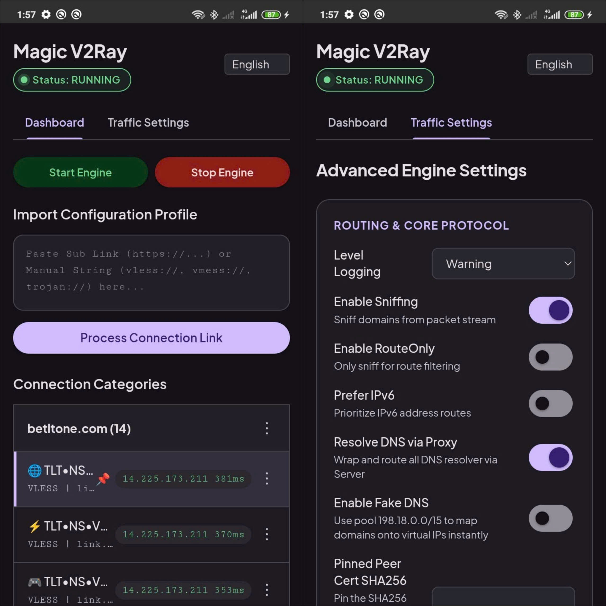

# Magic V2Ray

Một công cụ quản lý proxy Internet mạnh mẽ và dễ sử dụng dành cho các thiết bị Android đã root. Dự án giúp bạn định tuyến toàn bộ lưu lượng mạng của thiết bị qua một proxy server để bảo mật kết nối, vượt tường lửa, đồng thời chia sẻ kết nối tốc độ cao này cho các thiết bị khác.

---

## Magic V2Ray là gì?

**Magic V2Ray** là một công cụ mạng nâng cao được thiết kế riêng cho điện thoại Android đã root. Bằng cách kết hợp các lõi proxy hàng đầu hiện nay, dự án tạo ra một kết nối mượt mà xuyên suốt toàn hệ thống và bao phủ mọi ứng dụng của bạn.

Dự án đi kèm với một giao diện Web UI tối giản, nơi bạn có thể dễ dàng sắp xếp các cấu hình proxy, lưu trữ các liên kết đăng ký (subscription) và quản lý mạng lưới của mình chỉ với vài cú click.

---

## Vì sao nên dùng Magic V2Ray dành cho thiết bị Android đã root?

Nếu bạn đã quen dùng các app V2Ray thông thường (như v2rayNG, Matsuri, Nekobox), đây là lý do Magic V2Ray là một sự nâng cấp hoàn toàn khác biệt:

- **Bảo vệ toàn diện, Bất tử ngầm:** Các ứng dụng thông thường chạy trên tầng người dùng thông qua API `VPNService` của Android và rất dễ bị hệ thống "khai tử" (Kill) khi máy thiếu RAM hoặc tối ưu pin, gây mất kết nối hoặc rò rỉ IP thật. Magic V2Ray hoạt động với đặc quyền Root cao nhất, chạy ẩn như một tiến trình hệ thống (System Daemon) bất tử mà hệ điều hành không thể tự ý tắt.
- **Sức mạnh định tuyến tầng lõi:** Ứng dụng VPN truyền thống ép toàn bộ traffic đi qua một card mạng ảo (`tun0`), tạo ra độ trễ (Ping cao) và hao tổn tài nguyên phần cứng. Magic V2Ray tận dụng trực tiếp công cụ cấu hình mạng của nhân Linux (`iptables` / `ip rule` / `TPROXY`), đánh chặn gói tin ngay tại tầng hệ thống, mang lại tốc độ truyền tải tối đa và độ trễ cực thấp y như trên máy tính.
- **Tối ưu hóa Hiệu năng & Tiết kiệm Pin:**
  + **Giảm thiểu tối đa việc sao chép bộ nhớ:** Qua `VpnService`, gói tin đi từ App $\rightarrow$ chui vào Linux Kernel $\rightarrow$ hệ thống phải sao chép (copy) dữ liệu ngược lên tầng Java (User-space) của ứng dụng VPN để xử lý $\rightarrow$ rồi lại ném ngược từ User-space xuống Kernel để ra mạng thật. Việc nhảy qua nhảy lại này tốn rất nhiều chu kỳ CPU. Với Magic V2Ray, module dùng quyền Root tác động thẳng vào hạ tầng mạng gốc (`iptables` / `ip rule`). Gói tin đi từ App $\rightarrow$ gặp luật Kernel điều hướng thẳng vào Xray $\rightarrow$ phóng ra Internet. Toàn bộ quá trình diễn ra ở cấp độ Native mã máy, bỏ qua hoàn toàn lớp bọc Java Core của Android.
  + **Không bị nghẽn cổ chai hành đợi:** Lớp `VpnService` của Android quản lý tất cả các ứng dụng qua một cổng kiểm soát duy nhất do hệ thống phân phối. Khi bạn tải nặng (vừa xem video 4K vừa download), lớp này rất dễ bị nghẽn cổ chai (bottleneck) do hàng đợi của Java không xử lý kịp tốc độ đổ về của gói tin. Magic V2Ray chia tách và giải phóng traffic trực tiếp từ tầng Mangle ngay khi gói tin vừa được sinh ra, giúp băng thông được giải thoát tối đa.
  + **Tối ưu hóa xử lý gói tin:** Vì không phải đi qua một lớp VPN "ảo ảnh" bọc ngoài của hệ thống, độ trễ Ping (Latency) và thời gian thiết lập kết nối TCP ban đầu (Handshake) sẽ giảm đi vài miligiây. Gói tin đi thẳng, không bị xé nhỏ hay nhồi thêm các header quản lý VPN của Android Framework.
- **Chuyển mạng động không độ trễ:** Tự động phát hiện ngay lập tức khi bạn chuyển đổi qua lại giữa Wi-Fi và 4G/5G, tự động làm mới (Hot-reload) các quy tắc định tuyến tường lửa ngay trong nhân hệ điều hành, loại bỏ hoàn toàn tình trạng đơ mạng từ 5 đến 10 giây giống như các app VPN thông thường.
- **Hỗ trợ Root toàn diện:** Hoạt động hoàn hảo và mượt mà trên cả 3 nền tảng Root phổ biến hiện nay bao gồm Magisk, KernelSU, và APatch.

---

## Bạn không có root?

> [!IMPORTANT]
> Đây là một **module hệ thống** (dành cho Magisk / KernelSU / APatch), **KHÔNG PHẢI** là một ứng dụng (app) thông thường!

Nếu thiết bị của bạn chưa được root, hoặc bạn đang tìm kiếm một ứng dụng có giao diện trực quan độc lập chạy trên Android, Windows, macOS, hoặc iOS, vui lòng tham khảo danh sách các ứng dụng khách (GUI Clients) được hỗ trợ tại đây:
👉 **[Xray-core GUI Clients](https://github.com/xtls/xray-core#gui-clients)**

---

## Các tính năng chính

- **Quản lý theo danh mục (Category Organizing):** Gom nhóm các proxy server của bạn vào các thư mục hoặc danh mục tùy chỉnh.
- **Nhập liên kết thông minh (Smart Link Import):** Dễ dàng dán các URL đăng ký, các chuỗi cấu hình thô hoặc các đoạn mã văn bản hỗn hợp.
- **Cập nhật tự động với 1-Click (One-Click Auto-Reload):** Lưu lại các liên kết đăng ký để bạn có thể cập nhật toàn bộ danh mục chỉ bằng một lần chạm.
- **Không tốn pin (No Battery Drain):** Cơ chế xử lý gốc dưới nền đảm bảo thời lượng pin của bạn kéo dài hơn nhiều so với việc chạy các ứng dụng VPN độc lập nặng nề.

---

## Ghi nhận & Đóng góp

Dự án này được xây dựng dựa trên thành quả của những người đi trước. **Magic V2Ray** có sử dụng các file thực thi (binary) được biên dịch sẵn từ các dự án mã nguồn mở sau:
* **[Xray-core](https://github.com/XTLS/Xray-core):** Lõi hệ thống tối cao cho các mạng proxy thế hệ mới, xử lý các giao thức như VLESS, VMess, Trojan kết hợp với cơ chế giải mã gói tin (sniffing) linh hoạt.
* **[tun2socks](https://github.com/xjasonlyu/tun2socks):** Công cụ hiệu năng cao được sử dụng để bọc các kênh inbound SOCKS5/HTTP vào một giao diện mạng ảo TUN native của Linux.