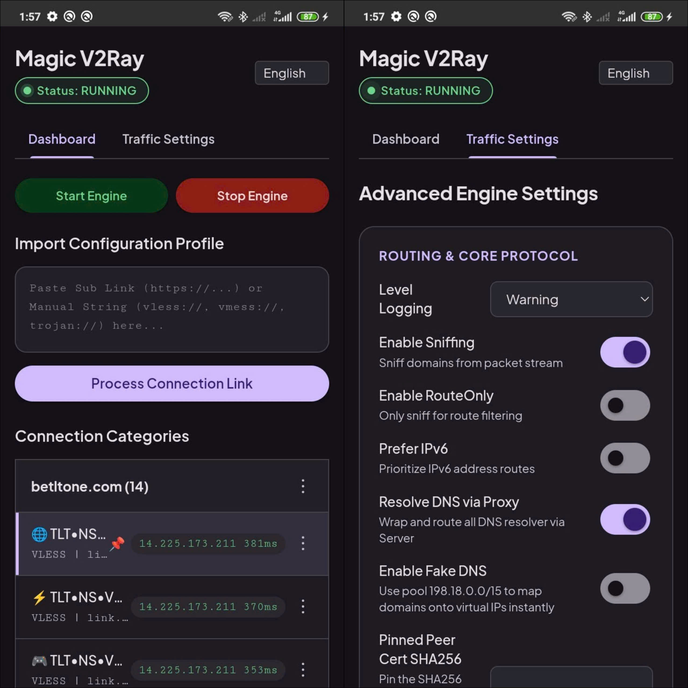

# Magic V2Ray

Một công cụ quản lý proxy Internet mạnh mẽ và dễ sử dụng dành cho các thiết bị Android đã root. Dự án giúp bạn định tuyến toàn bộ lưu lượng mạng của thiết bị qua một proxy server để bảo mật kết nối, vượt tường lửa, đồng thời chia sẻ kết nối tốc độ cao này cho các thiết bị khác.

---

## Magic V2Ray là gì?

**Magic V2Ray** là một công cụ mạng nâng cao được thiết kế riêng cho điện thoại Android đã root. Bằng cách kết hợp các lõi proxy hàng đầu hiện nay, dự án tạo ra một kết nối mượt mà xuyên suốt toàn hệ thống và bao phủ mọi ứng dụng của bạn.

Dự án đi kèm với một giao diện Web UI tối giản, nơi bạn có thể dễ dàng sắp xếp các cấu hình proxy, lưu trữ các liên kết đăng ký (subscription) và quản lý mạng lưới của mình chỉ với vài cú click.

---

## Vì sao nên dùng Magic V2Ray dành cho thiết bị Android đã root?

Nếu bạn đã quen thuộc với các ứng dụng V2Ray tiêu chuẩn (như v2rayNG, Matsuri, Nekobox), thì đây là lý do **Magic V2Ray** tạo nên sự khác biệt hoàn toàn:

* **Bao phủ toàn hệ thống, không bao giờ bị văng:** Các ứng dụng thông thường chạy ở không gian người dùng (user-space) thông qua API `VpnService` mặc định của Android. Khi bộ nhớ RAM bị đầy, hệ thống quản lý RAM gắt gao của Android (Low Memory Killer) sẽ dễ dàng tước quyền/tắt ứng dụng, làm gián đoạn kết nối hoặc rò rỉ IP thật của bạn. Magic V2Ray hoạt động với quyền Root, chạy như một tiến trình hệ thống (system daemon) giúp giữ kết nối luôn bền vững và không bao giờ bị hệ điều hành tắt khi thiếu RAM.
* **Định tuyến cả các lưu lượng mà `VpnService` "bó tay":** Ứng dụng xài `VpnService` chỉ can thiệp được lưu lượng từ các ứng dụng (UID) mà Android cho phép. Magic V2Ray gắn nhãn (mark) gói tin ngay tại tầng Netfilter, nhờ đó định tuyến được cả các tiến trình hệ thống. Đặc biệt, nó không chiếm dụng ô VPN mặc định của máy — giúp bạn thoải mái chạy song song với một ứng dụng VPN khác mà không bị xung đột, đồng thời loại bỏ hoàn toàn biểu tượng chìa khóa VPN phiền phức trên thanh trạng thái.
* **Hỗ trợ chia sẻ Hotspot / Tethering trực tiếp:** `VpnService` không thể định tuyến cho các thiết bị bắt Wi-Fi hotspot, vì Android chuyển tiếp dữ liệu của các thiết bị này bên ngoài không gian mạng của VPN. Magic V2Ray đánh chặn lưu lượng ngay tại chuỗi `PREROUTING` và định tuyến theo chính sách (policy-route) vào chung đường hầm tunnel. Nhờ vậy, mọi thiết bị kết nối vào hotspot của bạn đều tự động dùng proxy.
* **Tự động kết nối lại siêu mượt:** Tự động phát hiện quá trình chuyển đổi giữa Wi-Fi ↔ 4G/5G trực tiếp từ các sự kiện định tuyến của Kernel (`ip monitor`) thay vì hỏi dồn (polling) liên tục, giúp áp dụng lại các quy tắc định tuyến ngay lập tức mà không cần chờ thời gian timeout.
* **Hỗ trợ Root toàn diện:** Tương thích hoàn hảo trên mọi nền tảng Root phổ biến: Magisk, KernelSU và APatch.

---

## Bạn không có root?

> [!IMPORTANT]
> Đây là một **module hệ thống** (dành cho Magisk / KernelSU / APatch), **KHÔNG PHẢI** là một ứng dụng (app) thông thường!

Nếu thiết bị của bạn chưa được root, hoặc bạn đang tìm kiếm một ứng dụng có giao diện trực quan độc lập chạy trên Android, Windows, macOS, hoặc iOS, vui lòng tham khảo danh sách các ứng dụng khách (GUI Clients) được hỗ trợ tại đây:
👉 **[Xray-core GUI Clients](https://github.com/xtls/xray-core#gui-clients)**

---

## Các tính năng chính

- **Quản lý theo danh mục (Category Organizing):** Gom nhóm các proxy server của bạn vào các thư mục hoặc danh mục tùy chỉnh.
- **Nhập liên kết thông minh (Smart Link Import):** Dễ dàng dán các URL đăng ký, các chuỗi cấu hình thô hoặc các đoạn mã văn bản hỗn hợp.
- **Cập nhật tự động với 1-Click (One-Click Auto-Reload):** Lưu lại các liên kết đăng ký để bạn có thể cập nhật toàn bộ danh mục chỉ bằng một lần chạm.
- **Không tốn pin (No Battery Drain):** Cơ chế xử lý gốc dưới nền đảm bảo thời lượng pin của bạn kéo dài hơn nhiều so với việc chạy các ứng dụng VPN độc lập nặng nề.
- **Phát mạng Hotspot Native:** Chia sẻ kết nối proxy đã được bảo mật hoặc bypass cho các thiết bị khác qua Wi-Fi Hotspot với đầy đủ hỗ trợ định tuyến cho cả IPv4 và IPv6.

---

## Ghi nhận & Đóng góp

Dự án này được xây dựng dựa trên thành quả của những người đi trước. **Magic V2Ray** có sử dụng các file thực thi (binary) được biên dịch sẵn từ các dự án mã nguồn mở sau:
* **[Xray-core](https://github.com/XTLS/Xray-core):** Lõi hệ thống tối cao cho các mạng proxy thế hệ mới, xử lý các giao thức như VLESS, VMess, Trojan kết hợp với cơ chế giải mã gói tin (sniffing) linh hoạt.
* **[openxtun](https://github.com/vincentng295/openxtun):** Một trình bao bọc nhỏ gọn giúp mở thiết bị TUN trên Linux và chuyển bộ mô tả tệp (file descriptor) của nó cho Xray.
* **[curl-android](https://github.com/vvb2060/curl-android):** curl tool and libcurl static library prefab for android

## Giấy phép (License)

Dự án này được phát hành dưới giấy phép **GNU General Public License v3.0 (GPL-3.0)**.

Bằng cách sử dụng dự án này, bạn đồng ý với các điều khoản và điều kiện được quy định trong giấy phép. Để biết thêm chi tiết, vui lòng xem tệp [LICENSE](LICENSE) trong kho lưu trữ này.

Về cơ bản, bạn được tự do sử dụng, sửa đổi và phân phối phần mềm này, miễn là bạn giữ nguyên giấy phép và công khai mã nguồn trong dự án của chính bạn.